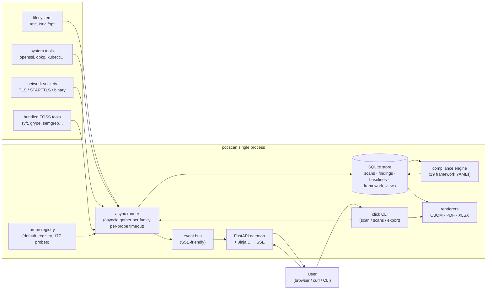
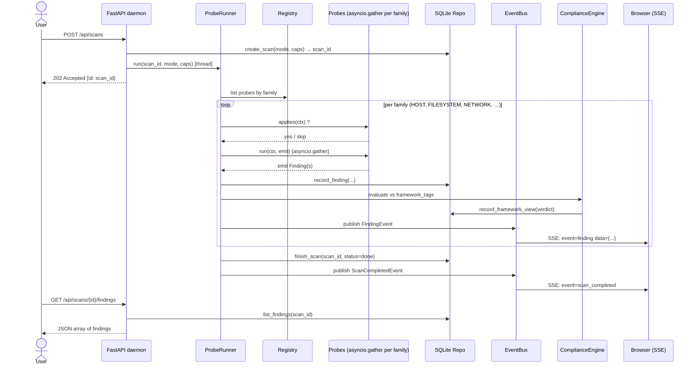
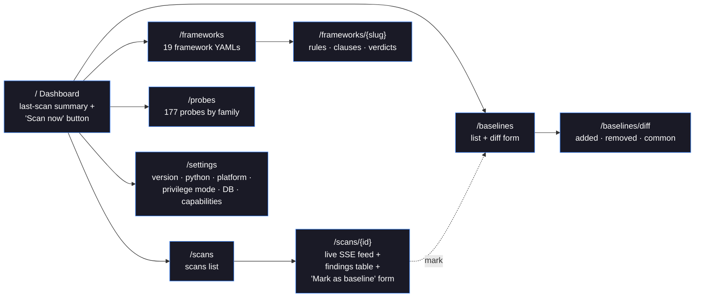
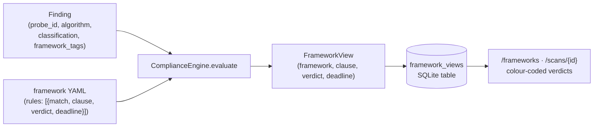
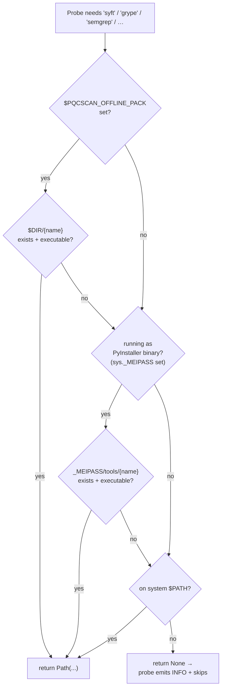
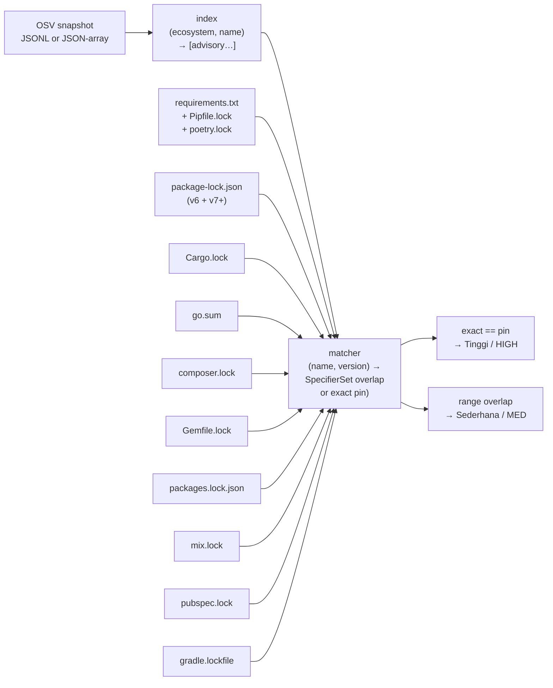
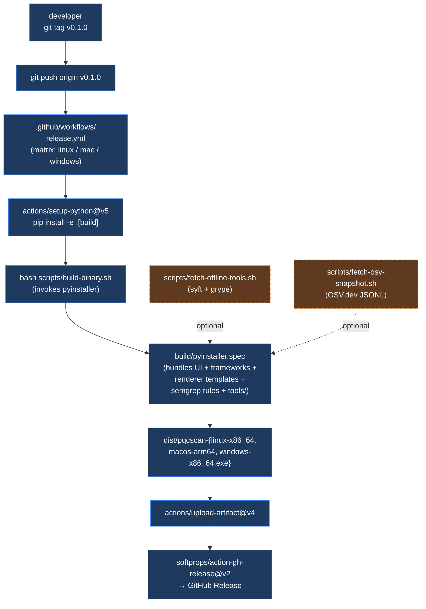

# pqcscan

Post-Quantum Cryptography (PQC) readiness scanner. Single Python process. Bundled web UI + headless CLI. Runs locally on Linux, Windows, macOS.

> **Status: 177 probes · 19 compliance frameworks · SARIF + CBOM + PDF + XLSX exports · light/dark web UI — see [docs/STATUS.md](docs/STATUS.md).**
> Scans point at the local host **or** a network endpoint (`--target`), filesystem paths (`--path`), or an OT/ICS endpoint (`--ot`). Every finding carries a typed PQC migration target + deadline, surfaced inline in the UI and in the SARIF export. See `docs/superpowers/specs/2026-04-29-pqcscan-v2-design.md` for the full design.

---

## Latest release — v0.9.11

Grab a **self-contained binary** — no Python, no `pip`, nothing else required on
the host — from the [**v0.9.11 release**](https://github.com/orengacademy/pqc-scanner2/releases/tag/v0.9.11):

| Platform | Asset | Floor |
|---|---|---|
| Linux x86_64 | `pqcscan-linux-x86_64` | glibc ≥ 2.17 (RHEL/OL 7.9+) |
| macOS arm64 | `pqcscan-macos-arm64` | macOS 11+ |
| Windows x86_64 | `pqcscan-windows-x86_64.exe` | Windows 8+ |

```bash
curl -fsSLo pqcscan \
  https://github.com/orengacademy/pqc-scanner2/releases/download/v0.9.11/pqcscan-linux-x86_64
chmod +x pqcscan
./pqcscan version          # -> pqcscan 0.9.11
./pqcscan scan --json      # scan the local host, print a JSON summary
```

**What v0.9.11 brings** (the full 0.9.x arc is in [`CHANGELOG.md`](CHANGELOG.md)
and [`docs/STATUS.md` §10](docs/STATUS.md)):

- **QUIC PQC probing** — decrypts the QUIC Initial packet (RFC 9001/9369) to read
  the TLS ClientHello's offered PQC groups. *No other FOSS — or verified
  commercial — tool reads PQC posture out of QUIC.*
- **Multi-modal binary scanning** — linked-library detection **+** `.dynsym`
  reachability ("is this crypto actually invoked?") **+** crypto-constant
  signatures (AES S-boxes, SHA/Keccak constants…) for **static/stripped** binaries.
- **Active *and* passive network sensing** — live handshake probing, live
  `AF_PACKET` sniffing, PCAP ingestion, Zeek/Suricata log ingestion, and OpenSSL
  **PQC provenance** (native ≥3.5 vs oqs-provider add-on vs none).
- **Precision & accuracy** — a per-finding **confidence** model, a **51-OID
  ground-truth recall oracle** over the full standardized PQC universe, HNDL /
  Mosca "harvest-now-decrypt-later" exposure scoring, and a migration-readiness
  score.

Three independent deep-research passes (against the authoritative *Santander
PQCTools* registry and the wider FOSS/commercial field) confirm pqcscan covers
**every FOSS discovery modality plus five categories the entire FOSS field
leaves empty** — see [`docs/COMPETITIVE-LANDSCAPE.md`](docs/COMPETITIVE-LANDSCAPE.md).

Prefer to run from source, or want the systemd/production deployment? See
[Install (development)](#install-development) and [Deployment (production)](#deployment-production).

---

## Table of contents

- [Latest release](#latest-release--v0911)
- [What it detects](#what-it-detects)
- [Architecture](#architecture)
- [Install (development)](#install-development)
- [Deployment (production)](#deployment-production)
- [Quickstart](#quickstart)
- [CLI](#cli)
- [Scan flow](#scan-flow)
- [Probe families](#probe-families)
- [Web UI map](#web-ui-map)
- [Compliance engine](#compliance-engine)
- [Offline pack & OSV matcher](#offline-pack--osv-matcher)
- [Build & release pipeline](#build--release-pipeline)
- [Tests](#tests)
- [Tech stack](#tech-stack)
- [Malaysia compliance](#malaysia-compliance)
- [Licence](#licence)

---

## What it detects

pqcscan answers one question across **every place cryptography hides**: *what
quantum-vulnerable crypto is here, is it actually used, and what should replace
it?* It is **multi-modal** — most tools do one of these; pqcscan does all of them
in one self-contained pass and merges the results into a single inventory:

| Surface | How | Examples |
|---|---|---|
| **Network — active** | Real TLS/STARTTLS/SSH/IKE/RDP/SMB handshakes | offered vs negotiated KEX groups, cipher suites, cert chains, PQC-hybrid groups (`X25519MLKEM768`) |
| **Network — passive** | Live `AF_PACKET` sniffing, PCAP files, **QUIC Initial decryption**, Zeek/Suricata logs | inventory crypto off the wire with no handshake; read PQC groups out of QUIC |
| **Certificates / PKI** | X.509 / PKCS#7 / CSR / keystore parsing + CT-log lookup | RSA/ECDSA leaf+chain, ML-DSA / SLH-DSA / composite PQC certs, expiry horizon |
| **Compiled binaries** | ELF/PE/Mach-O linkage **+** `.dynsym` reachability **+** crypto-constant signatures | which crypto lib a binary links, whether it's *invoked*, and crypto in **static/stripped** builds |
| **Source code** | Python `ast` + multi-language pattern/AST + Semgrep PQC rules | crypto-primitive calls, weak-alg usage, JWT/OAuth alg pinning |
| **Dependencies / SBOM** | OS + language package inventories → CBOM + offline OSV/CVE matching | quantum-vulnerable libraries, SBOM→crypto mapping |
| **Host & config** | openssl/gnutls/ssh/gnupg/JVM policy, crypto-policies, OpenSSL PQC **provenance** | native OpenSSL ≥3.5 PQC vs oqs-provider add-on vs none |
| **Storage / DB / MQ / HW** | LUKS/BitLocker/ZFS, DB-TDE, Kafka/RabbitMQ TLS, TPM/PKCS#11/smartcard | data-at-rest KEKs, broker transport, hardware crypto modules |
| **Containers / K8s** | image SBOM, ingress TLS, service-mesh mTLS/policy, Helm | cluster + mesh crypto posture |
| **OT / ICS** | Modbus / DNP3 / OPC-UA / BACnet endpoints | industrial-protocol crypto exposure |

**Every finding is classified** on the design-spec PQC threat model —
`Sangat-Tinggi` (broken now / quantum-broken + weak) › `Tinggi` (quantum-broken)
› `Sederhana` (quantum-weakened) › `Rendah` (quantum-safe headroom) › `PQC-Ready`
› `INFO` — with a parallel `CRIT`/`HIGH`/`MED`/`LOW`/`INFO` severity for ordinary
triage, **plus**:

- a **typed PQC migration target + FIPS standard + deadline** (e.g. RSA-2048 →
  ML-KEM-768 / FIPS 203; ECDSA-P256 → ML-DSA-65 / FIPS 204) and a per-language
  before→after remediation snippet;
- a **confidence** level (`high`/`medium`/`low`) — a structured cert parse or a
  live handshake is a fact; a regex hit in a comment is not — so probabilistic
  detections are down-ranked, not treated as certainties;
- an **HNDL** ("harvest now, decrypt later") flag and a **Mosca X+Y>Z** shelf-life
  verdict for data-in-transit exposure.

Aggregate decision outputs — a **migration-readiness score**, a multi-axis
**exposure register**, and the **19-framework compliance matrix** — roll the
findings up for planning. Detection accuracy is guarded by a **ground-truth
recall oracle** (the complete standardized PQC OID set must classify correctly)
and an accuracy benchmark harness in CI.

---

## Architecture

High-level component diagram. Everything inside the dotted box runs as a single Python process; the binary build (Plan F) packages this entire process into one file.



**Privilege model:** the daemon runs as the user; probes that need elevated capabilities (root, `NET_RAW`, `DAC_READ_SEARCH`) auto-skip with an INFO finding so the gap is visible but the scan keeps going.

**Localhost-only by default:** the FastAPI daemon binds `127.0.0.1:8765`. OS-level access is the trust boundary — there's no auth on the UI.

---

## Install (development)

```bash
git clone https://github.com/orengacademy/pqc-scanner2 pqcscan
cd pqcscan
pip install -e ".[dev]"
```

Requirements: Python 3.11+. Optional: `openssl` binary on PATH (used by some tests for cert generation).

---

## Deployment (production)

For production hosts, deploy the prebuilt release binary as a hardened systemd
service instead of the editable dev install — no Python or `ssl` module is
required on the host. See **[docs/DEPLOYMENT.md](docs/DEPLOYMENT.md)** for the
checksum-verified binary install, the systemd unit
([`packaging/systemd/pqcscan.service`](packaging/systemd/pqcscan.service)), the
root-vs-`DynamicUser` privilege trade-off, SSH-tunnel / nginx (TLS + Basic
auth) access paths, and SELinux notes.

> The daemon has no built-in auth and serves plain HTTP. Keep it bound to
> `127.0.0.1` unless it sits behind a TLS-terminating reverse proxy with auth.

---

## Quickstart

```bash
# Start the daemon (web UI on 127.0.0.1:8765 by default).
pqcscan daemon &

# Trigger a scan from the CLI.
pqcscan scan --json
# -> {"scan_id": 1, "finding_count": 12, "high_or_crit_count": 3, "db": "..."}

# List scans.
pqcscan scans

# Export the canonical CBOM (CycloneDX 1.7).
pqcscan export --scan 1 --format cbom -o cbom.json

# Or just visit the UI.
xdg-open http://127.0.0.1:8765
```

---

## CLI

```
pqcscan version                              # print version
pqcscan daemon [--port 8765] [--bind ...]    # start daemon + web UI
pqcscan scan [--json] [--watch]              # one-shot local-host scan
pqcscan scan --target host[:port]            # scan a network endpoint (TLS/STARTTLS)
pqcscan scan --path /etc/ssl --path /opt/app # scan filesystem paths (certs/keys/code/binaries)
pqcscan scan --ot plc.local:502:modbus       # scan an OT/ICS endpoint
pqcscan scan --fail-on high                  # CI gate: exit 1 if a finding >= band
                                             #   (none|low|med|high|crit; default high)
pqcscan scan --data-lifetime 15 \            # Mosca X+Y>Z shelf-life inputs
             --migration-years 3 --threat-years 10
pqcscan scans                                # list past scans
pqcscan status --id N                        # one scan's status
pqcscan export --scan N --format FMT -o ...  # FMT: cbom | sarif | pdf-tech |
             [--lang en|ms]                  #      pdf-exec | xlsx-bukukerja | xlsx-generic
```

`--format sarif` emits a SARIF 2.1.0 log for GitHub Code Scanning (each probe
becomes a rule; each finding a result with the PQC migration target + deadline +
`pqc_fix_before/after` snippet). Reports render bilingually via `--lang`
(English / Bahasa Melayu). A reusable **GitHub composite Action**
([`action.yml`](action.yml)) wraps *download binary → scan → export SARIF →
upload to the code-scanning tab*; see [`docs/CICD.md`](docs/CICD.md).

Exit codes:
- `0` — scan completed; nothing at/above the `--fail-on` band.
- `1` — scan completed; a finding at/above the `--fail-on` band is present.
- `2` — scan failed.
- `3` — invalid arguments.

---

## Scan flow

What happens when you `POST /api/scans` (or run `pqcscan scan`):



---

## Probe families

**177 probes across 15 families.** Each probe is a small `Probe` subclass that
declares an `id`, a `family`, and `framework_tags` for the compliance engine.
Current breakdown (verify any time with the snippet below):

| Family | # | Representative probes (★ = newer / notable) |
|---|--:|---|
| **NETWORK** | 41 | `tls.{https,imaps,smtps,ldaps,mqtts}` · `starttls.*` · `db.*_tls` · `tls.kex_groups` · `tls.pqc_handshake` · `ike.{v1v2,transforms}` · `ssh.handshake` · `kerberos.{asreq,etypes}` · `rdp` · `smb` · `snmp` · ★`telnet.plaintext` · ★`tftp.service` · ★`sniff.live` (passive) · `ct.crtsh` |
| **HOST** | 25 | `openssl.{version,ciphers,config,groups,fips_state,oqs_provider}` · ★`openssl.pqc_provenance` · `libcrypto_pqc_features` · `ssh.{server,client}_config` · `java.security` · `crypto_policies` · `cloud_kms` · `windows.schannel` · `macos.keychain` |
| **FILESYSTEM** | 24 | `cert.{x509,chain,csr,pkcs7,privkey,pqc_x509}` · ★`binary.crypto` (linkage + reachability + constants) · ★`pcap.crypto` (incl. **QUIC**) · ★`zeek.logs` · `conf.{nginx,apache,sshd,haproxy,envoy,f5,netscaler}` · `db.crypto` · `iac.{terraform,cloudformation}` |
| **STORAGE** | 18 | disk: `luks`·`bitlocker`·`zfs`·`dmcrypt`·`fscrypt` · db-TDE: `pg.pgcrypto`·`mysql.keyring`·`mssql.tde` · MQ: `kafka`·`rabbitmq`·`nats`·`mqtt` · HW: `tpm_algorithms`·`pkcs11_modules`·`smartcard_readers` |
| **SBOM** | 15 | `os.{dpkg,rpm,apk,…}` · `lang.{pip,npm,gomod,cargo,maven,…}` · `syft`·`grype`·`trivy` · `crypto_map` · `cve.osv_offline` |
| **OT** | 15 | industrial-protocol crypto exposure: `modbus`·`dnp3`·`opcua`·`bacnet`·… |
| **CODE** | 8 | `ts.{python,javascript,go,java,php,rust}` · `crypto_primitives` · `semgrep.pqc` |
| **CONTAINER** | 7 | `runtime.detect` · `image.sbom` · `k8s.{ingress,secrets,helm,mesh_mtls,mesh_policy}` |
| **APP** | 5 | `jwt.env_alg` · `oauth.jwks` · `spring.properties` · `nginx.jwt_validation` · `crypto_lib_pqc_support` |
| **SIGN** | 5 | `gpg.keyrings` · `repo.aptdnf_keys` · `code.authenticode` · `git.signing_keys` · `image.cosign` |
| **DNS_EMAIL** | 5 | `dnssec.zones` · `dkim.selectors` · `smime.certs` · `webauthn` · `trust.system_roots` |
| **PQC_META** | 4 | `kat.fips` (FIPS 203/204/205 KAT roundtrips) · `oqs.status` · … |
| **VPN** | 3 | `wireguard` · `openvpn` · `tailscale` |
| **AUX** | 2 | `clock.cert_validity` · … |

The ~15 FOSS-tool wrappers (syft, grype, trivy, testssl, sslyze, nmap,
pip-audit, npm-audit, govulncheck, cargo-audit, lynis, bandit, semgrep,
osv_offline) live *within* the families above and resolve their binaries via the
[offline-pack resolver](#offline-pack--osv-matcher) — absent tools self-skip.

Quick listing:

```bash
PYTHONPATH=src python3.11 -c \
  "from pqcscan.probes._registry import default_registry; \
   reg = default_registry(); \
   print(f'{len(reg.ids())} probes:'); \
   [print(f'  {p.id} ({p.family.name})') for p in reg.all()]"
```

Family-by-family breakdown is in [`docs/STATUS.md` §2](docs/STATUS.md#2-whats-shipped).

---

## Web UI map

The daemon ships 9 pages, fully translatable EN ↔ MS via the `pqcscan_locale` cookie:



POST `/i18n/{en|ms}` writes the locale cookie. Every template is rendered through a `_render()` helper that injects `t()` and `locale` into the template context.

Live findings on the scan-detail page arrive via Server-Sent Events from `GET /api/scans/{id}/events` — no polling.

---

## Compliance engine

Each probe declares a tuple of `framework_tags` like `("nist-ir-8547:tls", "bukukerja:tls", "mykripto:tls")`. After a scan finishes, the engine evaluates each finding against each framework's YAML rules and writes a `framework_views` row per (finding × framework) pair.



**19** bundled framework YAMLs (under `src/pqcscan/compliance/frameworks/`):

| Framework | File | Origin |
|---|---|---|
| BUKUKERJA Migrasi PQC 2025 | `bukukerja.yaml` | Malaysia operational handbook |
| MyKripto Migration Framework | `mykripto-migration-framework.yaml` | CyberSecurity Malaysia |
| NACSA Arahan KE No. 9 | `nacsa-arahan-ke-9.yaml` | National Cyber Security Agency MY |
| NIST IR 8547 | `nist-ir-8547.yaml` | NIST PQC transition planning |
| NIST SP 800-227 | `nist-sp-800-227.yaml` | KEM/PKE recommendations |
| CNSA 2.0 | `cnsa2.yaml` | NSA Commercial National Security Algorithm Suite |
| BSI TR-02102-1 | `bsi-tr-02102-1.yaml` | German federal crypto guidance |
| ANSSI PQC | `anssi-pqc.yaml` | French national agency |
| MAS Notice 655 | `mas-notice-655.yaml` | Singapore monetary authority |
| ENISA PQC | `enisa-pqc.yaml` | EU cybersecurity agency |
| PCI DSS 4.0 | `pci-dss-4.yaml` | Payment-card security (req. 12.3.3) |
| ISO/IEC 27001:2022 | `iso-27001-2022.yaml` | ISMS control A.8.24 (crypto) |
| EU DORA | `eu-dora.yaml` | EU Digital Operational Resilience Act |
| EU NIS2 | `eu-nis2.yaml` | EU network & information security directive |
| UK NCSC | `uk-ncsc.yaml` | UK NCSC PQC timelines (2028/2031/2035) |
| Australia ASD ISM | `au-asd-ism.yaml` | Australian Signals Directorate (2030) |
| Canada CCCS | `ca-cccs.yaml` | Canadian Centre for Cyber Security (2031/2035) |
| Japan CRYPTREC | `jp-cryptrec.yaml` | Japan cryptography research/evaluation |
| QRAMM | `qramm.yaml` | Quantum Readiness Assurance Maturity Model |

Rule format (excerpt from `bukukerja.yaml`):
```yaml
framework: bukukerja
rules:
  - match: { classification: sangat-tinggi }
    clause: BUKUKERJA:risk-register/sangat-tinggi
    verdict: non-compliant
    note: "Algoritma terdedah secara klasik atau oleh Shor/Grover."
```

Adding a new framework needs **zero code changes** — just drop a new YAML.

---

## Offline pack & OSV matcher

Resolution flow for FOSS-tool binaries (`pqcscan.util.offline_pack.resolve_tool`) and the OSV snapshot path:



The 14 FOSS-tool probes use this resolver via the `resolve_or_none(self.X_bin, "tool-name")` helper that also validates explicit `<x>_bin` constructor args.

### `cve.osv_offline` ecosystem coverage



The default snapshot path is `/var/lib/pqcscan/osv-snapshot.jsonl`; override with `PQCSCAN_OSV_SNAPSHOT=<path>` or pass `snapshot_path=` to the probe constructor.

Snapshot fetch (one command):

```bash
bash scripts/fetch-osv-snapshot.sh                  # PyPI + npm + Go (~75 MB)
bash scripts/fetch-osv-snapshot.sh PyPI npm         # specific ecosystems
bash scripts/fetch-osv-snapshot.sh --all            # every ecosystem (~1+ GB)
bash scripts/fetch-osv-snapshot.sh --out /var/lib/pqcscan/osv-snapshot.jsonl
```

Range-aware PyPI matching uses the `packaging` library: `requirements.txt` lines like `flask>=1.0,<2.0` are overlap-checked against OSV `affected[].versions` and `affected[].ranges[].events[]` — if there's any vulnerable version inside the constraint, the probe emits a `Sederhana` ("potentially affected") finding. Exact `==` pins still emit `Tinggi`.

---

## Build & release pipeline

How a release tarball gets made, end to end:



Local single-OS build:

```bash
pip install -e ".[build]"           # installs pyinstaller>=6
bash scripts/fetch-offline-tools.sh # optional: bundle syft + grype too
bash scripts/fetch-osv-snapshot.sh  # optional: bundle OSV snapshot
bash scripts/build-binary.sh
./dist/pqcscan --help
```

Output: `dist/pqcscan` (Linux/macOS) or `dist/pqcscan.exe` (Windows). Build artifacts live under `build/pqcscan-work/` and are gitignored. The spec file at [`build/pyinstaller.spec`](build/pyinstaller.spec) is committed and stays in sync with the registry — new probes get picked up automatically via globbing.

Cross-OS release artifacts (Linux x86_64 + macOS arm64 + Windows x86_64) are produced automatically by [`.github/workflows/release.yml`](.github/workflows/release.yml) on any `v*` tag push. Each binary is uploaded as a GitHub Release asset alongside auto-generated release notes.

---

## Tests

```bash
PYTHONPATH=src python -m pytest -q                    # ~1226 tests, ~2.5 min
PYTHONPATH=src python -m pytest -q --cov=pqcscan      # with coverage
```

**~1226 tests** (1 skipped when `semgrep` isn't on the host) across 132 files in
`tests/unit/` and `tests/integration/`. Correctness-critical crypto is anchored
to standards test vectors — e.g. the QUIC key derivation is checked against the
**RFC 9001 Appendix A.1** vector, and a **51-OID ground-truth oracle** asserts the
complete standardized PQC OID universe classifies correctly. An accuracy
benchmark harness gates measured precision/recall in CI.

> CI note: the GitHub `test` jobs run ~60 min (dominated by the `net.ct.crtsh`
> external call, PDF-render, and subprocess-scan tests); the local suite is ~2.5
> min. See [`docs/STATUS.md` §10](docs/STATUS.md).

---

## Tech stack

Python 3.11+, FastAPI, uvicorn, SQLAlchemy 2.0, Jinja2 + HTMX (vendored), click, pydantic v2, loguru, `cryptography>=42` (X.509 + the QUIC/TLS AEAD primitives), cyclonedx-python-lib, packaging, python-multipart, WeasyPrint, openpyxl, PyYAML. Build deps: PyInstaller>=6. Optional `[active]` extra: `liboqs-python>=0.12` for live KAT roundtrips. All FOSS.

---

## Malaysia compliance

Probe `framework_tags` include `bukukerja:*`, `mykripto:*`, and `nacsa-arahan-ke-9:*`; the YAML-driven compliance engine maps findings to MyKripto's Migration Framework, NACSA Arahan KE No. 9, and 7 international frameworks (NIST IR 8547, NIST SP 800-227, CNSA 2.0, BSI TR-02102-1, ANSSI PQC, MAS Notice 655, ENISA PQC). See `docs/references/malaysia-pqc.md` for source URLs.

---

## Contributing & support

- **Contribute:** see [`CONTRIBUTING.md`](CONTRIBUTING.md) for setup, the project layout, how to add a probe or compliance framework, and the PR checklist.
- **Bugs / features:** open an [issue](https://github.com/orengacademy/pqc-scanner2/issues/new/choose) — there are templates for both.
- **Security:** see [`SECURITY.md`](SECURITY.md). Email `tools@orengacademy.com` with subject prefix `[pqcscan-security]` instead of opening a public issue.
- **Release history:** [`CHANGELOG.md`](CHANGELOG.md).

## Licence

MIT — see [`LICENSE`](LICENSE).
