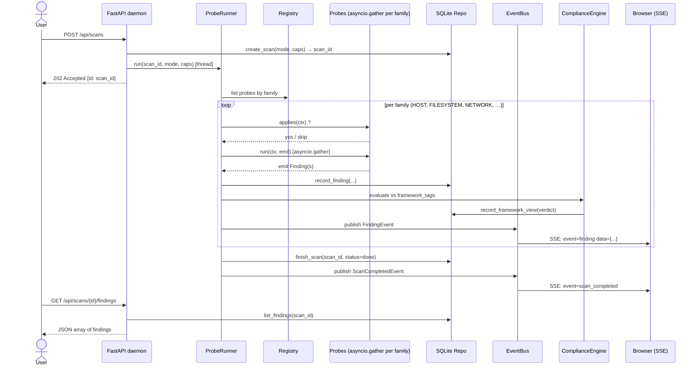
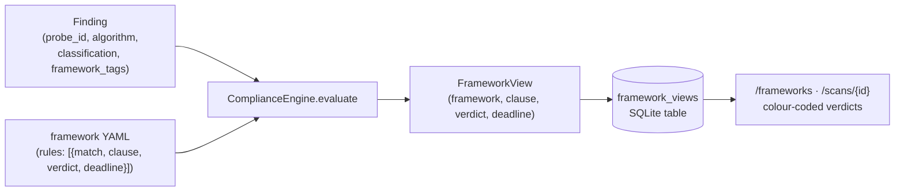
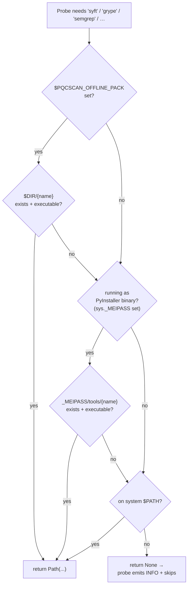
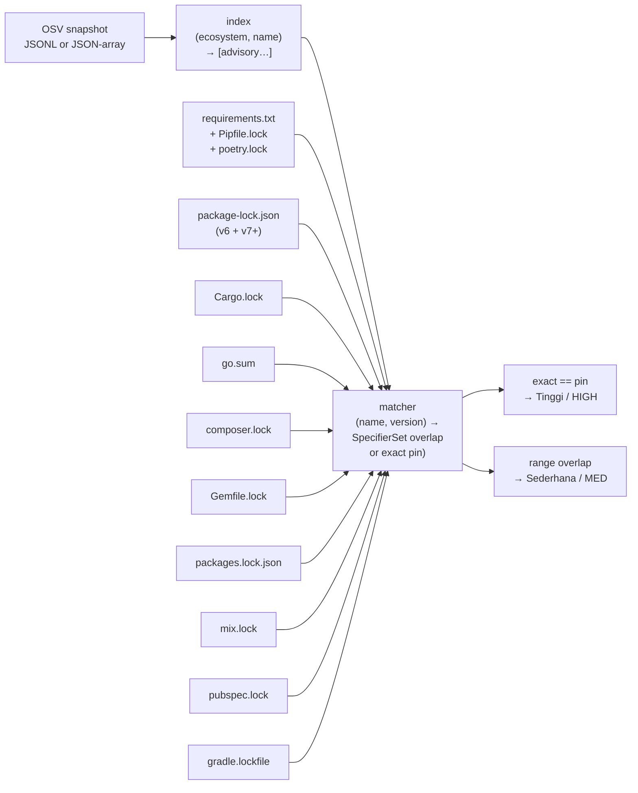
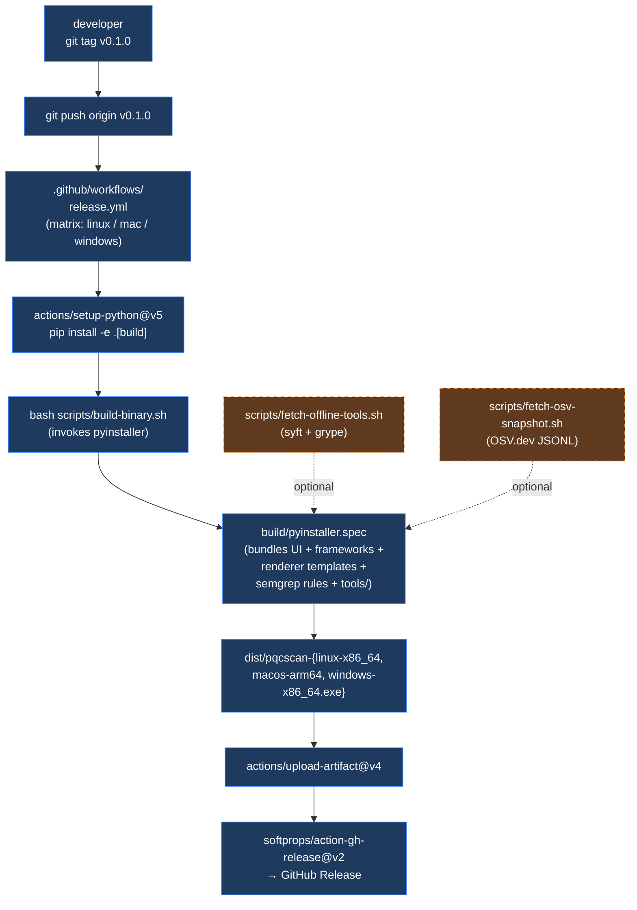

# pqcscan

Post-Quantum Cryptography (PQC) readiness scanner. Single Python process. Bundled web UI + headless CLI. Runs locally on Linux, Windows, macOS.

> **Status: 109 / 102 probes shipped — see [docs/STATUS.md](docs/STATUS.md).** Plans A+B+C+D+E+F+G are all done: asyncio runner, FastAPI daemon + SSE, click CLI, 9-page Jinja+HTMX web UI with EN/MS toggle, SQLite store with baselines + scan diff, CycloneDX 1.6 CBOM, PDF + XLSX renderers, 10-framework YAML compliance engine, PyInstaller cross-OS build pipeline, offline-pack runtime resolver wired through all 14 FOSS-tool probes. The `cve.osv_offline` matcher works across **10 ecosystems / 12 lockfile formats** (PyPI, npm, crates.io, Go, Packagist, RubyGems, NuGet, Hex, Pub, Maven), with **range-aware PyPI matching** via the `packaging` library so non-pinned `requirements.txt` constraints are also covered. Only Plan F batch 4 (multi-GB Grype-DB snapshot bundling — a release-pipeline decision) remains.
> See `docs/superpowers/specs/2026-04-29-pqcscan-v2-design.md` for the full design.

---

## Table of contents

- [Architecture](#architecture)
- [Install (development)](#install-development)
- [Quickstart](#quickstart)
- [CLI](#cli)
- [Scan flow](#scan-flow)
- [Probe families](#probe-families)
- [Web UI map](#web-ui-map)
- [Compliance engine](#compliance-engine)
- [Offline pack & OSV matcher](#offline-pack--osv-matcher)
- [Build & release pipeline](#build--release-pipeline)
- [Tests](#tests)
- [Tech stack](#tech-stack)
- [Malaysia compliance](#malaysia-compliance)
- [Licence](#licence)

---

## Architecture

High-level component diagram. Everything inside the dotted box runs as a single Python process; the binary build (Plan F) packages this entire process into one file.


**Privilege model:** the daemon runs as the user; probes that need elevated capabilities (root, `NET_RAW`, `DAC_READ_SEARCH`) auto-skip with an INFO finding so the gap is visible but the scan keeps going.

**Localhost-only by default:** the FastAPI daemon binds `127.0.0.1:8765`. OS-level access is the trust boundary — there's no auth on the UI.

---

## Install (development)

```bash
git clone https://github.com/orengacademy/pqc-scanner2 pqcscan
cd pqcscan
pip install -e ".[dev]"
```

Requirements: Python 3.11+. Optional: `openssl` binary on PATH (used by some tests for cert generation).

---

## Quickstart

```bash
# Start the daemon (web UI on 127.0.0.1:8765 by default).
pqcscan daemon &

# Trigger a scan from the CLI.
pqcscan scan --json
# -> {"scan_id": 1, "finding_count": 12, "high_or_crit_count": 3, "db": "..."}

# List scans.
pqcscan scans

# Export the canonical CBOM (CycloneDX 1.6).
pqcscan export --scan 1 --format cbom -o cbom.json

# Or just visit the UI.
xdg-open http://127.0.0.1:8765
```

---

## CLI

```
pqcscan version                              # print version
pqcscan daemon [--port 8765] [--bind ...]    # start daemon + web UI
pqcscan scan [--json] [--watch]              # one-shot in-process scan
pqcscan scans                                # list past scans
pqcscan status --id N                        # one scan's status
pqcscan export --scan N --format cbom -o ... # export CycloneDX 1.6
```

Exit codes:
- `0` — scan completed; nothing high/crit.
- `1` — scan completed; high or crit findings present.
- `2` — scan failed.
- `3` — invalid arguments.

---

## Scan flow

What happens when you `POST /api/scans` (or run `pqcscan scan`):



---

## Probe families

109 probes registered across 14 families. Each probe is a small `Probe` subclass that declares an `id`, a `family`, and `framework_tags` for the compliance engine to map findings.

```mermaid
flowchart TB
    REG["default_registry()<br/><b>109 probes</b>"]

    REG --> HOST["<b>HOST</b> · 6<br/>openssl.config / ciphers / engines<br/>ssh.server_config / client_config<br/>gnupg.config"]
    REG --> FS["<b>FILESYSTEM</b> · 6<br/>cert.x509 · cert.privkey<br/>conf.{nginx,apache,sshd,openssl_cnf}"]
    REG --> NET["<b>NETWORK</b> · ~30<br/>tls.{https,imaps,pop3s,smtps,ldaps,mqtts}<br/>starttls.{smtp,imap,pop3,ftp,ldap}<br/>db.{postgres,mongo,redis,mysql}_tls<br/>ports.tcp · ssh.handshake · ike.v1v2<br/>rdp · smb · snmp · kerberos"]
    REG --> SBOM["<b>SBOM</b> · 12<br/>os.{dpkg,rpm,apk,pacman,brew,windows}<br/>lang.{pip,npm,gomod,cargo,maven,composer}"]
    REG --> CODE["<b>CODE</b> · 7<br/>ts.{python,javascript,go,java,php,rust}<br/>+ semgrep.pqc"]
    REG --> VPN["<b>VPN</b> · 3<br/>wireguard · openvpn · tailscale"]
    REG --> STORAGE["<b>STORAGE</b> · 16<br/>luks · bitlocker · zfs · dmcrypt · fscrypt<br/>db-tde: pg.pgcrypto · mysql.keyring ·<br/>mssql.tde · mongo.encrypted_storage<br/>mq: kafka · rabbitmq · nats · mqtt<br/>hw: tpm · pkcs11 · smartcard"]
    REG --> CONTAINER["<b>CONTAINER + K8S</b> · 6<br/>runtime.detect · image.sbom<br/>k8s.{ingress,secrets,helm,mesh}"]
    REG --> APP["<b>APP</b> · 5<br/>jwt.env_alg · oauth.jwks<br/>dotenv.secrets · spring.properties<br/>nginx.jwt_validation"]
    REG --> SIGN["<b>SIGN</b> · 5<br/>gpg.keyrings · repo.aptdnf_keys<br/>code.authenticode · git.signing_keys<br/>image.cosign"]
    REG --> DNS["<b>DNS_EMAIL + WEB</b> · 5<br/>dnssec.zones · dkim.selectors<br/>smime.certs · webauthn · trust.system_roots"]
    REG --> AUX["<b>AUX + PQC_META</b> · 3<br/>clock.cert_validity<br/>alg.normaliser · hybrid placeholder"]
    REG --> SECRETS["<b>SECRETS</b> · 1<br/>gitleaks"]
    REG --> FOSS["<b>FOSS-tool wrappers</b> · ~15<br/>syft · grype · trivy · testssl ·<br/>sslyze · nmap · pip-audit · npm-audit ·<br/>govulncheck · cargo-audit · lynis ·<br/>bandit · semgrep · osv_offline"]

    classDef hostfam fill:#1e3a5f,color:#fff,stroke:#3b82f6
    classDef stofam fill:#3a1e5f,color:#fff,stroke:#a855f7
    classDef netfam fill:#1e5f3a,color:#fff,stroke:#22c55e
    class HOST,APP,SIGN hostfam
    class FS,STORAGE,SBOM,CODE,DNS stofam
    class NET,VPN,CONTAINER,SECRETS,AUX,FOSS netfam
```



Each `Finding` carries a **classification** (`Sangat-Tinggi`, `Tinggi`, `Sederhana`, `Rendah`, `PQC-Ready`, `INFO`) per the design spec's Appendix B PQC threat model, and a parallel **severity** (`CRIT`, `HIGH`, `MED`, `LOW`, `INFO`) for ordinary triage.

Quick listing:

```bash
PYTHONPATH=src python3.11 -c \
  "from pqcscan.probes._registry import default_registry; \
   reg = default_registry(); \
   print(f'{len(reg.ids())} probes:'); \
   [print(f'  {p.id} ({p.family.name})') for p in reg.all()]"
```

Family-by-family breakdown is in [`docs/STATUS.md` §2](docs/STATUS.md#2-whats-shipped).

---

## Web UI map

The daemon ships 9 pages, fully translatable EN ↔ MS via the `pqcscan_locale` cookie:


POST `/i18n/{en|ms}` writes the locale cookie. Every template is rendered through a `_render()` helper that injects `t()` and `locale` into the template context.

Live findings on the scan-detail page arrive via Server-Sent Events from `GET /api/scans/{id}/events` — no polling.

---

## Compliance engine

Each probe declares a tuple of `framework_tags` like `("nist-ir-8547:tls", "bukukerja:tls", "mykripto:tls")`. After a scan finishes, the engine evaluates each finding against each framework's YAML rules and writes a `framework_views` row per (finding × framework) pair.



Bundled framework YAMLs (under `src/pqcscan/compliance/frameworks/`):

| Framework | File | Origin |
|---|---|---|
| BUKUKERJA Migrasi PQC 2025 | `bukukerja.yaml` | Malaysia operational handbook |
| MyKripto Migration Framework | `mykripto-migration-framework.yaml` | CyberSecurity Malaysia |
| NACSA Arahan KE No. 9 | `nacsa-arahan-ke-9.yaml` | National Cyber Security Agency MY |
| NIST IR 8547 | `nist-ir-8547.yaml` | NIST PQC transition planning |
| NIST SP 800-227 | `nist-sp-800-227.yaml` | KEM/PKE recommendations |
| CNSA 2.0 | `cnsa2.yaml` | NSA Commercial National Security Algorithm Suite |
| BSI TR-02102-1 | `bsi-tr-02102-1.yaml` | German federal crypto guidance |
| ANSSI PQC | `anssi-pqc.yaml` | French national agency |
| MAS Notice 655 | `mas-notice-655.yaml` | Singapore monetary authority |
| ENISA PQC | `enisa-pqc.yaml` | EU cybersecurity agency |

Rule format (excerpt from `bukukerja.yaml`):
```yaml
framework: bukukerja
rules:
  - match: { classification: sangat-tinggi }
    clause: BUKUKERJA:risk-register/sangat-tinggi
    verdict: non-compliant
    note: "Algoritma terdedah secara klasik atau oleh Shor/Grover."
```

Adding a new framework needs **zero code changes** — just drop a new YAML.

---

## Offline pack & OSV matcher

Resolution flow for FOSS-tool binaries (`pqcscan.util.offline_pack.resolve_tool`) and the OSV snapshot path:



The 14 FOSS-tool probes use this resolver via the `resolve_or_none(self.X_bin, "tool-name")` helper that also validates explicit `<x>_bin` constructor args.

### `cve.osv_offline` ecosystem coverage



The default snapshot path is `/var/lib/pqcscan/osv-snapshot.jsonl`; override with `PQCSCAN_OSV_SNAPSHOT=<path>` or pass `snapshot_path=` to the probe constructor.

Snapshot fetch (one command):

```bash
bash scripts/fetch-osv-snapshot.sh                  # PyPI + npm + Go (~75 MB)
bash scripts/fetch-osv-snapshot.sh PyPI npm         # specific ecosystems
bash scripts/fetch-osv-snapshot.sh --all            # every ecosystem (~1+ GB)
bash scripts/fetch-osv-snapshot.sh --out /var/lib/pqcscan/osv-snapshot.jsonl
```

Range-aware PyPI matching uses the `packaging` library: `requirements.txt` lines like `flask>=1.0,<2.0` are overlap-checked against OSV `affected[].versions` and `affected[].ranges[].events[]` — if there's any vulnerable version inside the constraint, the probe emits a `Sederhana` ("potentially affected") finding. Exact `==` pins still emit `Tinggi`.

---

## Build & release pipeline

How a release tarball gets made, end to end:



Local single-OS build:

```bash
pip install -e ".[build]"           # installs pyinstaller>=6
bash scripts/fetch-offline-tools.sh # optional: bundle syft + grype too
bash scripts/fetch-osv-snapshot.sh  # optional: bundle OSV snapshot
bash scripts/build-binary.sh
./dist/pqcscan --help
```

Output: `dist/pqcscan` (Linux/macOS) or `dist/pqcscan.exe` (Windows). Build artifacts live under `build/pqcscan-work/` and are gitignored. The spec file at [`build/pyinstaller.spec`](build/pyinstaller.spec) is committed and stays in sync with the registry — new probes get picked up automatically via globbing.

Cross-OS release artifacts (Linux x86_64 + macOS arm64 + Windows x86_64) are produced automatically by [`.github/workflows/release.yml`](.github/workflows/release.yml) on any `v*` tag push. Each binary is uploaded as a GitHub Release asset alongside auto-generated release notes.

---

## Tests

```bash
pytest -q --cov=pqcscan --cov-report=term-missing
```

~365 tests across `tests/unit/` and `tests/integration/`. The `e2e` smoke flow against the real OSV.dev PyPI snapshot is documented in commits `28fb7a8` (where the dedupe bug was caught + fixed against 19,220 live records) and `c92956e` (`scripts/fetch-osv-snapshot.sh`).

---

## Tech stack

Python 3.11, FastAPI 0.136, uvicorn, SQLAlchemy 2.0, Jinja2 + HTMX 1.9 (vendored), click, pydantic v2, loguru, cryptography 47, cyclonedx-python-lib 7.6+, packaging, python-multipart, WeasyPrint, openpyxl, PyYAML. Build deps: PyInstaller>=6. All FOSS.

---

## Malaysia compliance

Probe `framework_tags` include `bukukerja:*`, `mykripto:*`, and `nacsa-arahan-ke-9:*`; the YAML-driven compliance engine maps findings to MyKripto's Migration Framework, NACSA Arahan KE No. 9, and 7 international frameworks (NIST IR 8547, NIST SP 800-227, CNSA 2.0, BSI TR-02102-1, ANSSI PQC, MAS Notice 655, ENISA PQC). See `docs/references/malaysia-pqc.md` for source URLs.

---

## Contributing & support

- **Contribute:** see [`CONTRIBUTING.md`](CONTRIBUTING.md) for setup, the project layout, how to add a probe or compliance framework, and the PR checklist.
- **Bugs / features:** open an [issue](https://github.com/orengacademy/pqc-scanner2/issues/new/choose) — there are templates for both.
- **Security:** see [`SECURITY.md`](SECURITY.md). Email `tools@orengacademy.com` with subject prefix `[pqcscan-security]` instead of opening a public issue.
- **Release history:** [`CHANGELOG.md`](CHANGELOG.md).

## Licence

MIT — see [`LICENSE`](LICENSE).
